# gcdatacatalog
gcdatacatalog : Google Cloud Data Catalog # Metadata Management # Tag

## Objective 
- Enable the Data Catalog API so that you can use this service in your Google Cloud project.
- Create a dataset with BigQuery.
- Copy a public New York Taxi table to your dataset.
- Create a Data Catalog tag template.
- Create & attach a tag to a table with Data Catalog
- Tag your newly created table with the newly created tags.

## Metadata Management using Google Cloud Data Catalog

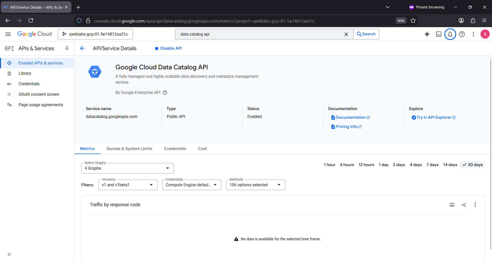

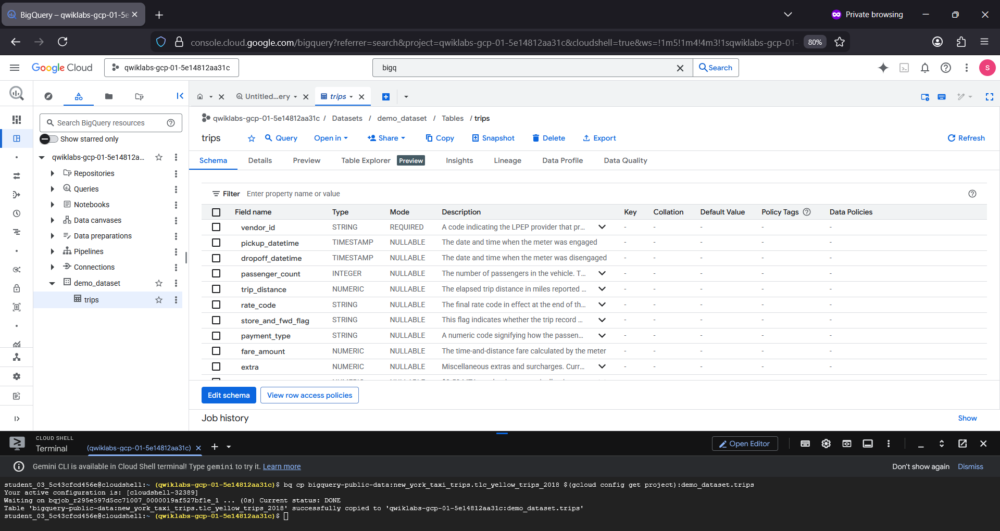

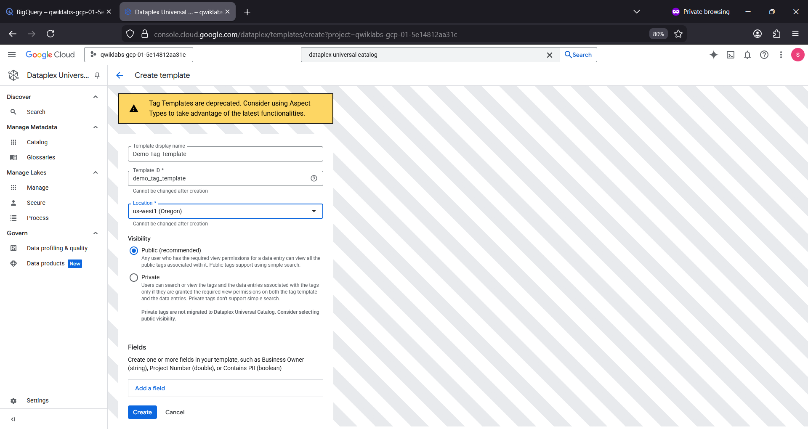

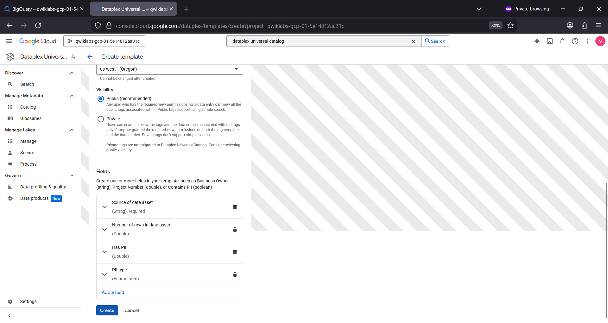

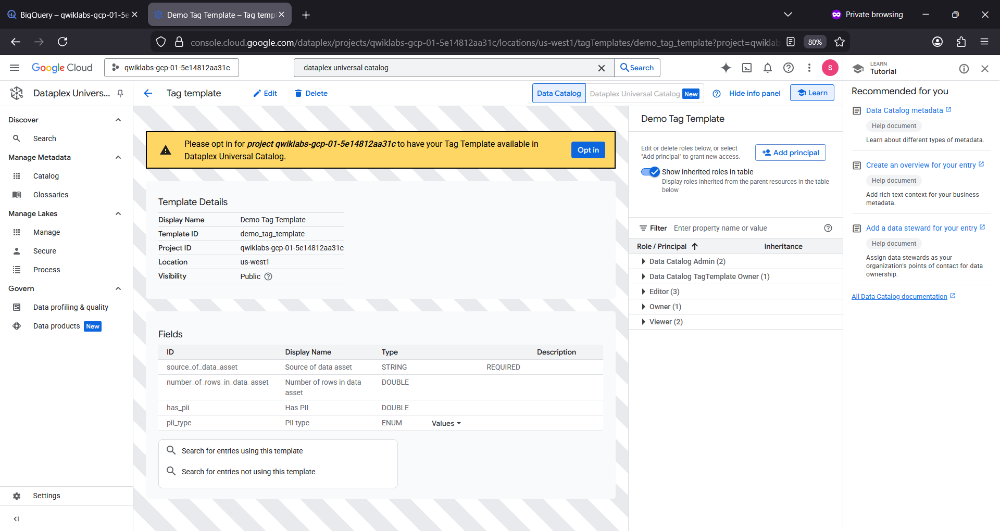

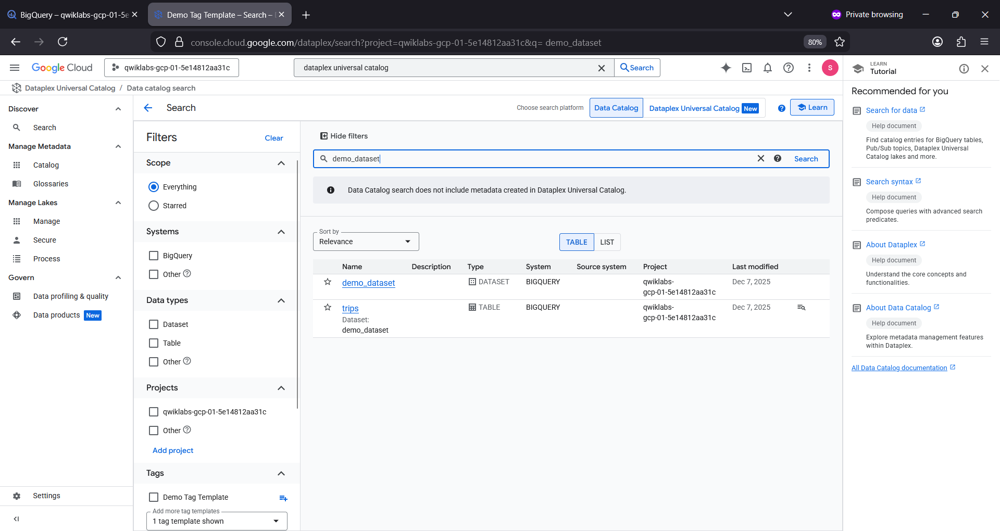

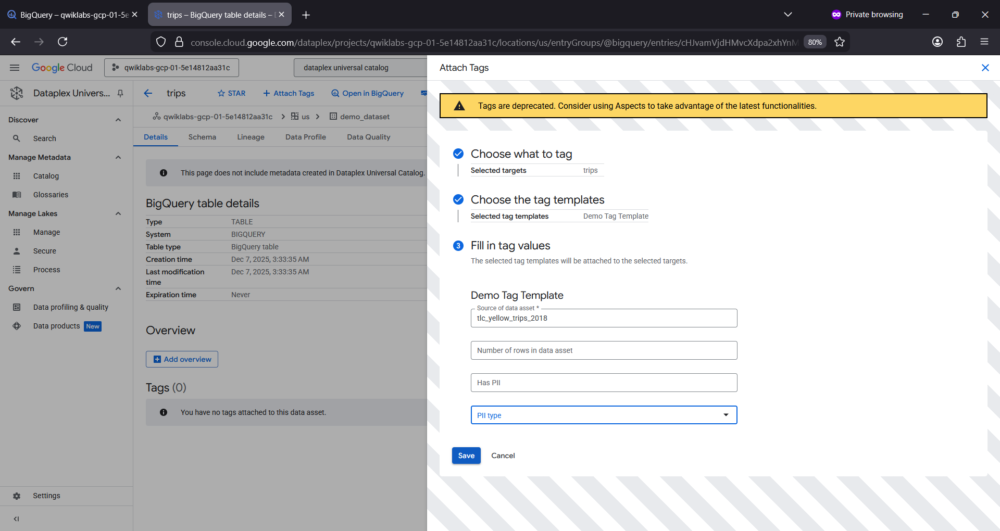

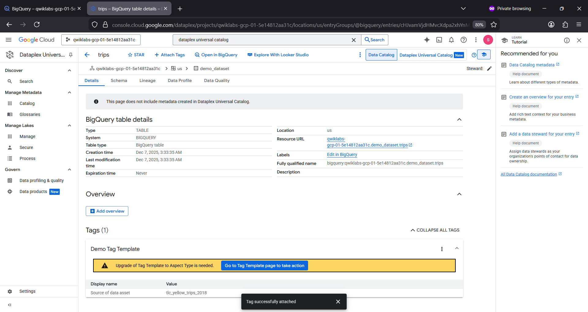

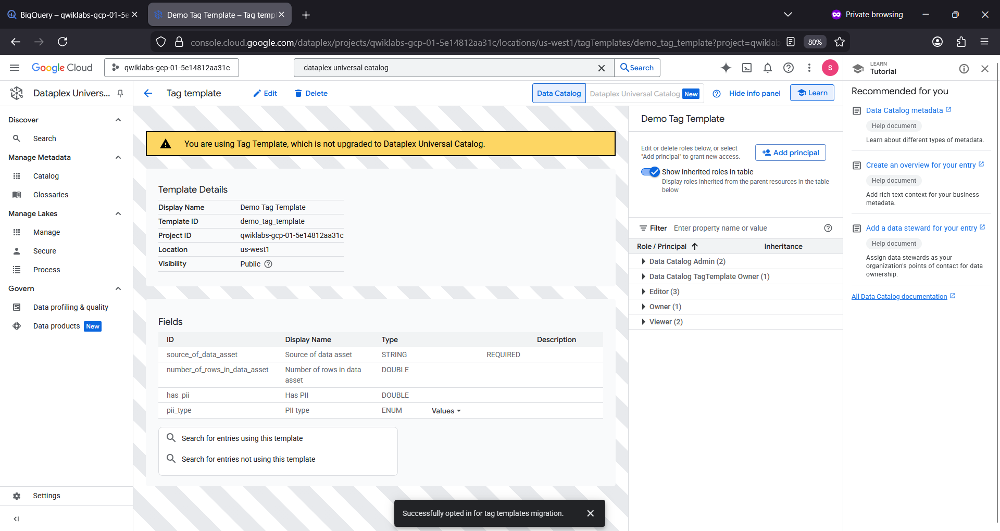

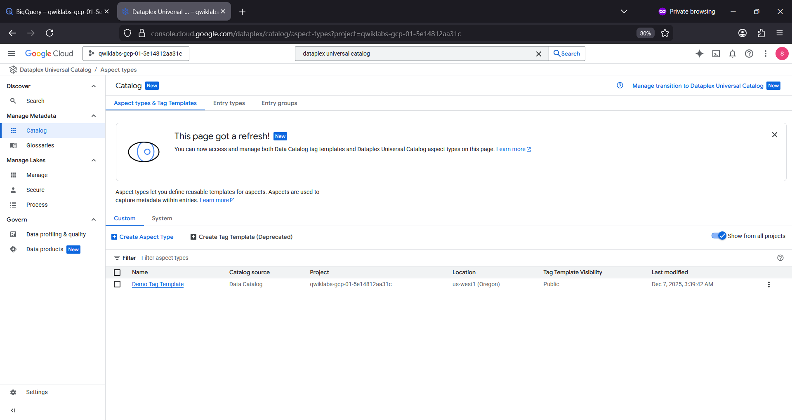

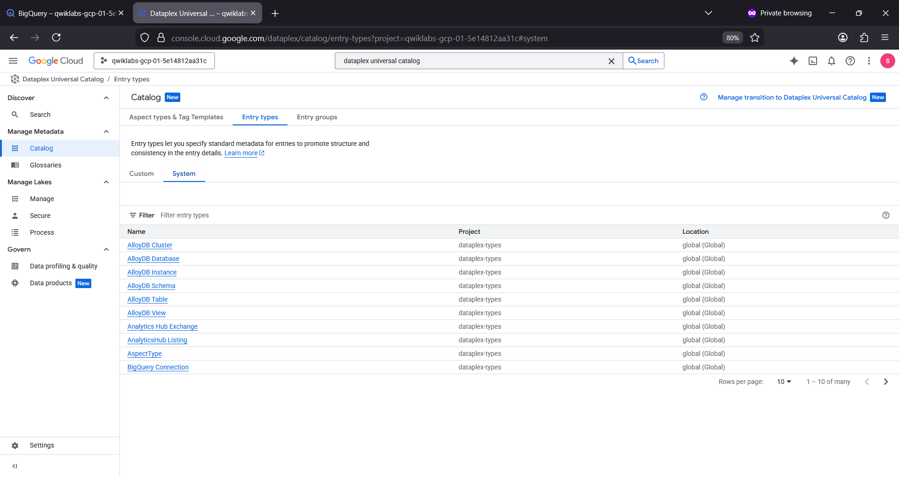

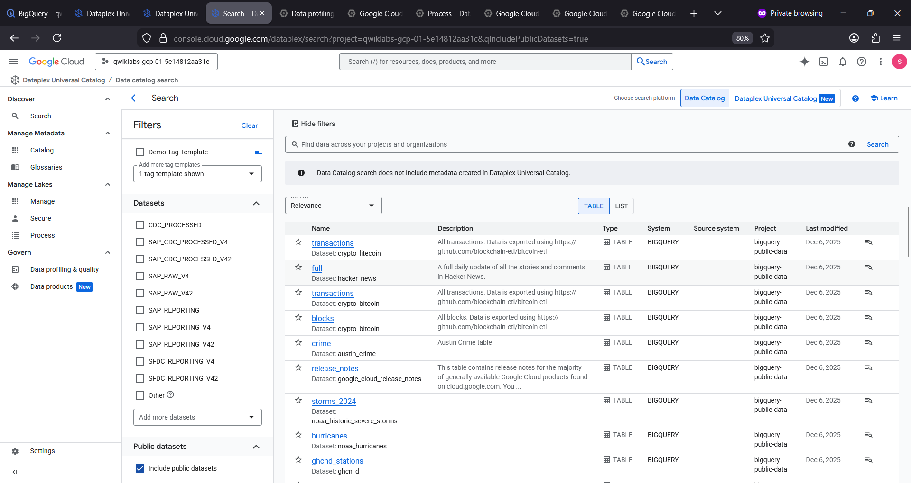

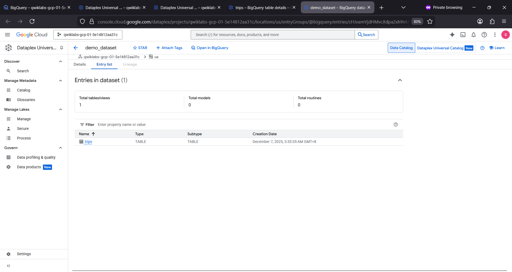

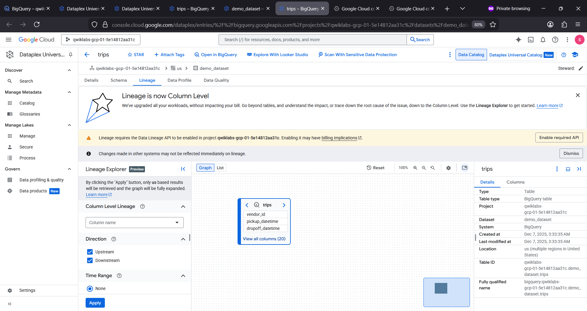

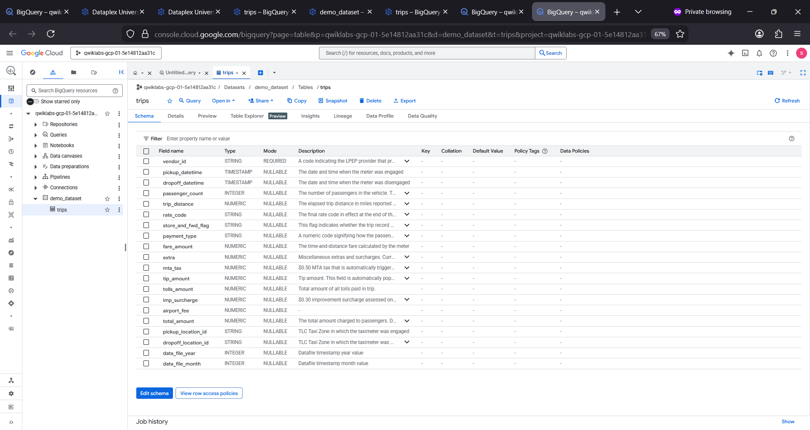
